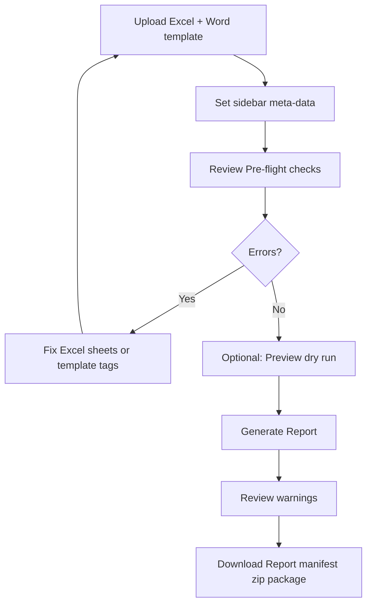

# 02 — User guide (Streamlit application)

This guide walks report authors and QA staff through the web application from first launch to downloaded deliverable.

## Prerequisites

- Python 3.10+ with dependencies installed ([README](../README.md#setup)).
- A prepared **Excel** workbook and **Word or PDF template** (or use sidebar sample downloads).

## Launching the application

```powershell
streamlit run app.py
```

The app opens in your browser (default `http://localhost:8501`). Use **localhost** on office machines; do not expose the server broadly without IT approval (see [07-security-and-deployment.md](07-security-and-deployment.md)).

## Screen layout

### Header and upload zones

Two columns:

| Column | Control | Accepts |
|--------|---------|---------|
| Left | **Excel Data Source (.xlsx)** | One `.xlsx` file |
| Right | **Report template (.docx or .pdf)** | One Word or PDF file |

After selection, a caption shows file name and size.

**PDF templates:** The app converts PDF to Word internally for merging (cached per file so reruns are fast). You still need Jinja2 `{{ tags }}` in the document—add them in Word after conversion using **Download converted Word template (.docx)**, or upload a tagged `.docx` instead. Pre-flight will warn if no tags are detected.

### Sidebar — Report type and meta-data

| Field | Purpose | Recorded in manifest |
|-------|---------|----------------------|
| **Report phase** | `Phase 1` or `Phase 2` | Yes — controls `LabResults` requirement; changing phase updates the default profile |
| **Profile** | `phase1_alberta`, `phase2_esa`, or `template_driven` | Yes (`report_type`) — maps Excel sheets to template loops |
| **Prepared by** | Author name on cover / signature block | Yes |
| **Date of issue** | Report issue date (ISO format internally) | Yes |
| **Template version** | Optional semver, e.g. `2.1.0` | Yes — auto-suggested from filename when name contains `v2.1` etc. |
| **Override executive summary** | Replaces Excel / auto-generated Phase I text when filled | Yes |

**Phase 1:** `LabResults` sheet is optional; lab table may be empty. Default profile: **Alberta Phase I ESA (Ecoventure)**.

**Phase 2:** `LabResults` sheet is required; pre-flight errors if missing. Selecting **Phase 2** switches profile to **Phase II ESA**.

See [13-flexible-report-profiles.md](13-flexible-report-profiles.md) for custom templates and optional **`ReportConfig`** sheet in Excel.

Sidebar also provides **download buttons** for sample Excel and Word files when `samples/` exists (auto-created on first use if missing).

### AI settings (sidebar, bottom)

- Toggle **Use cloud LLM** — requires `OPENAI_API_KEY` in environment or `.streamlit/secrets.toml`.
- When off, AI tab uses offline rule-based fallbacks only.

### Tabs

#### Report generation (primary workflow)

1. **Analyze uploaded Word template** (expander) — Lists root `{{ variables }}` and block tags; warns about possible split tags.
2. **Pre-flight checks** — Sheet names, errors, warnings, matched/missing template variables (profile-aware checklist), split-tag lint; download **missing-fields checklist** or **ReportConfig sheet (Excel)**.
3. **Workflow step indicator** — Visual checklist: Excel → Template → Pre-flight OK → Output.
4. **Preview data (dry run)** — Builds merge context and manifest **without** rendering Word (fast QA); top scalar keys and table row counts.
5. **Standard phrases (optional)** — Select preset paragraphs (drilling waste intro, site recon, Phase II recommendation, etc.); overrides Excel for those keys.
6. **Appendices (optional)** — Upload PDFs labeled **A–F** (Alberta Phase I); included in deliverable zip.
7. **Generate Report** — Primary action; disabled until uploads valid and pre-flight has no **errors**.
8. **Download section** — Report `.docx`, warnings, context preview, manifest JSON, **Download deliverable package (.zip)** when report or appendices exist.

#### AI assistant

Optional tools: template tagger, lab PDF → Excel, narrative drafts, pre-flight copilot, consistency checker, exceedance notes. See [09-ai-assistant.md](09-ai-assistant.md). **All AI output is draft** — review before client use.

## Standard workflow (recommended)



### Step 1 — Upload files

- Excel must contain sheet **`ProjectData`** (exact name).
- Phase 2 Excel must also contain **`LabResults`**.
- Template must be `.docx` or `.pdf` with valid Jinja2 tags in the merged Word document (see [04-template-authoring.md](04-template-authoring.md)).

### Step 2 — Pre-flight

| Pre-flight result | Meaning | Action |
|-------------------|---------|--------|
| **Errors** (red) | Cannot generate — missing sheet, invalid file, security rejection | Fix before continuing |
| **Warnings** (yellow) | Can generate — missing optional tags, empty recommended fields, split-tag hints | Fix for production quality |
| **Matched / missing vars** | Template `{{ tags }}` vs Excel + sidebar keys | Add Excel columns or sidebar values for missing tags |

Download **missing-fields checklist** (includes profile-recommended fields) or **ReportConfig sheet (Excel)** from pre-flight when offered — paste into Excel planning.

### Step 3 — Dry-run preview (optional)

Expander **Preview data (dry run)**:

- Shows top scalar context keys and table row counts (`lab_results`, `drilling_waste`, `storage_tanks`).
- Download manifest JSON without producing Word.
- Use before a long render or when validating a new template.

### Step 4 — Generate Report

When Excel has more than one populated `ProjectData` row, choose:

| Mode | Use when |
|------|----------|
| **Single report** | One site (uses row 2 only) |
| **All N reports (batch)** | Multiple sites — one `.docx` per row (max 50 per run) |

- Spinner shows while `ReportEngine` renders (or batch loop).
- Success message includes warning count and suggested filename (or batch count).
- Hard failures show a user-safe error and **Common fixes** expander.

For batch runs, link shared table sheets with `site_name`, `project_number`, `uwi`, `well_name`, or `project_id` on `LabResults` / `DrillingWaste` rows. See [03-excel-data-guide.md](03-excel-data-guide.md).

### Step 5 — Download and archive

| Download | Use |
|----------|-----|
| **Download Report** | Client-ready `.docx` |
| **Download batch reports (.zip)** | When batch mode was used — all generated `.docx` files |
| **Download generation manifest (JSON)** | Audit: SHA-256 hashes, timestamps, missing variables, template source (`docx`/`pdf`), appendix hashes, AI audit entries |
| **Download deliverable package (.zip)** | `report.docx`, manifest JSON, `appendices/` folder (and converted template if PDF was uploaded) |

Store manifest alongside issued reports for reproducibility ([BEST_PRACTICES.md](../BEST_PRACTICES.md)). A single merged client PDF is not produced in-app—export Word to PDF separately if needed.

## Session state behavior

The app remembers during your browser session:

- Last generated `.docx` (for download after navigation)
- Warnings and context preview
- Generation record for manifest export
- AI audit log (included in manifest after generate)

Refreshing the browser clears session state unless Streamlit persistence is configured.

## Filename convention

Download names are derived automatically:

```
{site_name}_{Phase_1|Phase_2}_{date}.docx
```

Special characters sanitized; falls back to `ESA` if site name empty.

## Using sample files (first-time demo)

1. Sidebar → **Download sample Excel** and **Download sample Word template**.
2. Re-upload those files in the main uploaders (or use copies from `samples/` folder).
3. Generate — expect lab table with one exceedance row in red bold.

Production-aligned samples: `production_data.xlsx`, `production_template.docx`.

## When Generate is disabled

| Condition | Fix |
|-----------|-----|
| No Excel or template uploaded | Upload both files |
| Pre-flight errors | Resolve sheet/tag/file issues |
| Another render in progress | Wait for spinner to finish |
| Wrong file extension | Use `.xlsx` and `.docx` or `.pdf` for template |

## Template help expander

Bottom of Report tab links to:

- `PRODUCTION_TEMPLATE_GUIDE.txt`
- `EXCEL_LAYOUT.txt`
- `JINJA2_CHEATSHEET.txt`
- `BEST_PRACTICES.md`

Full detail: [03-excel-data-guide.md](03-excel-data-guide.md), [04-template-authoring.md](04-template-authoring.md).

## Troubleshooting (user-facing)

| Symptom | Likely cause | Fix |
|---------|--------------|-----|
| Missing sheet `ProjectData` | Wrong tab name | Rename sheet exactly `ProjectData` |
| Missing sheet `LabResults` | Phase 2 without lab tab | Add `LabResults` or switch to Phase 1 |
| Template rendering failed | Broken Jinja or split `{{ tag }}` | Re-type tags in one Word run; see pre-flight split lint |
| Empty fields in output | Tag name mismatch | Align Excel headers with `{{ snake_case }}` names |
| Lab table shows header twice | Loop includes header row | Static header row **above** `` |
| Excel too large | Over 15 MB | Reduce file size or split data |
| Red exceedance missing | Used `result_plain` | Use `{{ item.result_display }}` in table |

More: [10-glossary-faq.md](10-glossary-faq.md).
