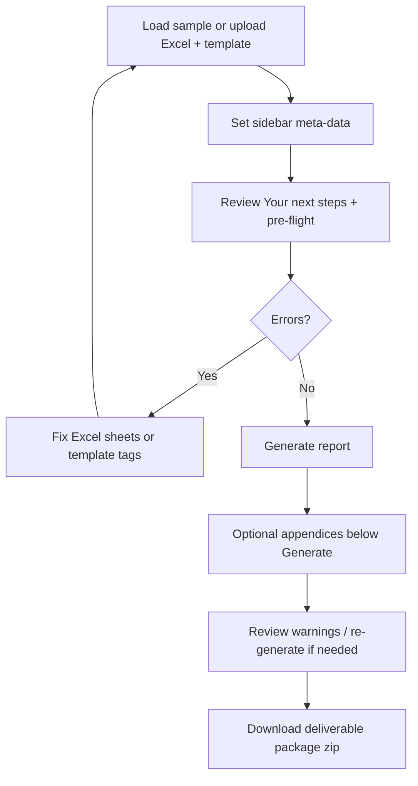

# 02 — User guide (Streamlit application)

This guide walks report authors and QA staff through the web application from first launch to downloaded deliverable.

## Prerequisites

- Python 3.10+ with dependencies installed ([README](../README.md#setup)).
- A prepared **Excel** workbook and **Word or PDF template** (or use sidebar sample downloads).

## Launching the application

```powershell
streamlit run app.py
```

The app opens in your browser (default `http://localhost:8501`). Use **localhost** on office machines; do not expose the server broadly without IT approval (see [07-security-and-deployment.md](07-security-and-deployment.md)).

## Choose your workflow

On first launch, pick one path (see also [00-start-here.md](00-start-here.md)):

| Choice | When to use |
|--------|-------------|
| **Project folder + AI** | Local site folder with `project_data.xlsx`, `template.docx`, optional `source/`, `appendices/`, `rag/`. AI drafts land in `ai_drafts/`. |
| **Excel + Word template** | Upload `.xlsx` + `.docx`/`.pdf` directly — **recommended for first report**. |

Use **Change** in the banner to switch workflows later. A dismissible **Welcome** card guides first-time users.

### Project folder path

1. Enter path or click **Browse…** (local desktop only).
2. **Load folder** — reads Excel + template into the app.
3. Optional **Analyze folder** — writes inventory, preflight, narratives to `ai_drafts/` on disk.
4. Open **Report** tab → pre-flight → Generate.

Full layout and CLI: [22-project-folder-workflow.md](22-project-folder-workflow.md).

## Screen layout

### Menu bar and keyboard shortcuts

Under the Ecoventure header, a Windows-style menu bar provides **File**, **Edit**, **View**, **Tools**, and **Help**:

| Menu | Common actions |
|------|----------------|
| **File** | Open / focus project folder, load Alberta Phase I sample, clear outputs, change workflow |
| **Edit** | Toggle Simple mode |
| **View** | Glossary, restore Getting started checklist |
| **Tools** | Pointers to AI tools and folder analyze |
| **Help** | Contents (HTML help), keyboard shortcuts, About |

Press **F1** to open the packaged HTML help (`help/index.html`) in your browser. Rebuild help with `python scripts/build_help.py`. Other actions are menu-driven — Streamlit runs in the browser and does not own a native OS accelerator bar (only **F1** is hooked globally).

### Header and upload zones (Excel + template workflow)

When you chose **Excel + Word template**, two columns:

| Column | Control | Accepts |
|--------|---------|---------|
| Left | **Excel Data Source (.xlsx)** | One `.xlsx` file |
| Right | **Report template (.docx or .pdf)** | One Word or PDF file |

After selection, a caption shows file name and size.

**PDF templates:** The app converts PDF to Word internally for merging (cached per file so reruns are fast). You still need Jinja2 `{{ tags }}` in the document—add them in Word after conversion using **Download converted Word template (.docx)**, or upload a tagged `.docx` instead. Pre-flight will warn if no tags are detected.

### Sidebar — Report type and meta-data

| Field | Purpose | Recorded in manifest |
|-------|---------|----------------------|
| **Report phase** | `Phase 1` or `Phase 2` | Yes — controls `LabResults` requirement; changing phase updates the default profile |
| **Profile** | `phase1_alberta`, `phase2_esa`, or `template_driven` | Yes (`report_type`) — maps Excel sheets to template loops |
| **Prepared by** | Author name on cover / signature block | Yes |
| **Date of issue** | Report issue date (ISO format internally) | Yes |
| **Template version** | Optional semver, e.g. `2.1.0` | Yes — auto-suggested from filename when name contains `v2.1` etc. |
| **Override executive summary** | Replaces Excel / auto-generated Phase I text when filled | Yes |

**Phase 1:** `LabResults` sheet is optional; lab table may be empty. Default profile: **Alberta Phase I ESA (Ecoventure)**.

**Phase 2:** `LabResults` sheet is required; pre-flight errors if missing. Selecting **Phase 2** switches profile to **Phase II ESA**.

See [13-flexible-report-profiles.md](13-flexible-report-profiles.md) for custom templates and optional **`ReportConfig`** sheet in Excel.

### Sidebar — Simple mode and samples

- **Simple mode (recommended for new users)** — hides executive summary override; AI settings move to **Advanced — AI options**.
- **Getting started** checklist — tracks workflow → metadata → files → pre-flight → generate → download.
- **Load Alberta Phase I sample into session** — one-click demo pair under **Sample templates** (no manual upload required).

Sidebar also provides **download buttons** for sample Excel and Word files when `samples/` exists (auto-created on first use if missing).

### AI settings (sidebar, Advanced when Simple mode on)

- Toggle **Use free/local LLM when available** — prefers Ollama (local) or Gemini/Groq free tier from `.streamlit/secrets.toml` (see [09-ai-assistant.md](09-ai-assistant.md)).
- When off, AI tab uses offline rule-based fallbacks only.

### Tabs

#### Report generation (primary workflow)

Follow the **1–4 step indicator**: Inputs → Pre-flight → Generate → Download.

1. **File status** — Excel / template loaded chips at top of Report tab.
2. **Your next steps** — plain-language action card (errors first, then warnings).
3. **Pre-flight checks** — summary line; technical details in expanders (**Regulatory checklist (SED 002)**, **Drilling waste compliance (DWDA)**, **Review recommended**).
4. **Generate report** — primary action; disabled until pre-flight has no **errors**.
5. **Appendices (optional PDF uploads)** — OneStop checklist row for **B, C, E, F, H**; expand per letter to upload PDFs (below Generate; re-generate to include new uploads in the zip).
6. **Download deliverables** — **Download deliverable package (.zip)** as primary button; **Before OneStop upload** checklist; **Advanced downloads** for `.docx`, manifest, generated appendices.
7. **Advanced** expander — dry-run preview, template tag analysis, glossary.
8. **Help & documentation** expander — links to consultant docs (collapsed).
9. **Standard phrases (optional)** — expander above the Report / AI tabs.

#### AI assistant

Second tab: **AI drafts & tools** (project folder workflow) or **AI tools** (Excel + template upload). Optional: template tagger, lab PDF → Excel, narrative drafts, pre-flight copilot, consistency checker, exceedance notes. See [09-ai-assistant.md](09-ai-assistant.md). **All AI output is draft** — review before client use.

## Standard workflow (recommended)



### Step 1 — Upload files

- Excel must contain sheet **`ProjectData`** (exact name).
- Phase 2 Excel must also contain **`LabResults`**.
- Template must be `.docx` or `.pdf` with valid Jinja2 tags in the merged Word document (see [04-template-authoring.md](04-template-authoring.md)).

### Step 2 — Pre-flight

| Pre-flight result | Meaning | Action |
|-------------------|---------|--------|
| **Errors** (red) | Cannot generate — missing sheet, invalid file, security rejection | Fix before continuing |
| **Warnings** (yellow) | Can generate — missing optional tags, empty recommended fields, split-tag hints | Fix for production quality |
| **Matched / missing vars** | Template `{{ tags }}` vs Excel + sidebar keys | Add Excel columns or sidebar values for missing tags |

Download **missing-fields checklist** (includes profile-recommended fields) or **ReportConfig sheet (Excel)** from pre-flight when offered — paste into Excel planning.

### Step 3 — Dry-run preview (optional)

Expander **Preview data (dry run)**:

- Shows top scalar context keys and table row counts (`lab_results`, `drilling_waste`, `storage_tanks`).
- Download manifest JSON without producing Word.
- Use before a long render or when validating a new template.

### Step 4 — Generate report

When Excel has more than one populated `ProjectData` row, choose **Generation mode**:

| Mode | Use when |
|------|----------|
| **Single site** | One site (pick which `ProjectData` row) |
| **All N sites (batch zip)** | Multiple sites — one `.docx` per row (max 50 per run) |

- Spinner shows while `ReportEngine` renders (or batch loop).
- Success message includes warning count and suggested filename (or batch count).
- Hard failures show a user-safe error and **Common fixes** expander.

For batch runs, link shared table sheets with `site_name`, `project_number`, `uwi`, `well_name`, or `project_id` on `LabResults` / `DrillingWaste` rows. See [03-excel-data-guide.md](03-excel-data-guide.md).

### Step 5 — Download and archive

| Download | Use |
|----------|-----|
| **Download deliverable package (.zip)** | **Primary** — report, manifest, appendices, OneStop export |
| **Download report (.docx)** | Advanced downloads — client-ready Word only |
| **Download reports only (.docx zip, N files)** | Advanced batch downloads — Word files without full packages |
| **Download generation manifest (JSON)** | Audit: SHA-256 hashes, timestamps, missing variables, template source (`docx`/`pdf`), appendix hashes, AI audit entries |

Store manifest alongside issued reports for reproducibility ([BEST_PRACTICES.md](../BEST_PRACTICES.md)). A single merged client PDF is not produced in-app—export Word to PDF separately if needed.

## Session state behavior

The app remembers during your browser session:

- Last generated `.docx` (for download after navigation)
- Warnings and context preview
- Generation record for manifest export
- AI audit log (included in manifest after generate)

Refreshing the browser clears session state unless Streamlit persistence is configured.

## Filename convention

Download names are derived automatically:

```
{site_name}_{Phase_1|Phase_2}_{date}.docx
```

Special characters sanitized; falls back to `ESA` if site name empty.

## Using sample files (first-time demo)

1. Sidebar → **Download sample Excel** and **Download sample Word template**.
2. Re-upload those files in the main uploaders (or use copies from `samples/` folder).
3. Generate — expect lab table with one exceedance row in red bold.

Production-aligned samples: `production_data.xlsx`, `production_template.docx`.

## When Generate is disabled

| Condition | Fix |
|-----------|-----|
| No Excel or template uploaded | Upload both files |
| Pre-flight errors | Resolve sheet/tag/file issues |
| Another render in progress | Wait for spinner to finish |
| Wrong file extension | Use `.xlsx` and `.docx` or `.pdf` for template |

## Help & documentation

Collapsed expander at the bottom of the Report tab links to consultant docs (start-here, user guide, Phase I, DWDA, Excel/Word authoring).

Developer reference files (repo root / `docs/`): `PRODUCTION_TEMPLATE_GUIDE.txt`, `EXCEL_LAYOUT.txt`, `JINJA2_CHEATSHEET.txt`, `BEST_PRACTICES.md`.

Full detail: [03-excel-data-guide.md](03-excel-data-guide.md), [04-template-authoring.md](04-template-authoring.md).

## Troubleshooting (user-facing)

| Symptom | Likely cause | Fix |
|---------|--------------|-----|
| Missing sheet `ProjectData` | Wrong tab name | Rename sheet exactly `ProjectData` |
| Missing sheet `LabResults` | Phase 2 without lab tab | Add `LabResults` or switch to Phase 1 |
| Template rendering failed | Broken Jinja or split `{{ tag }}` | Re-type tags in one Word run; see pre-flight split lint |
| Empty fields in output | Tag name mismatch | Align Excel headers with `{{ snake_case }}` names |
| Lab table shows header twice | Loop includes header row | Static header row **above** `` |
| Excel too large | Over 15 MB | Reduce file size or split data |
| Red exceedance missing | Used `result_plain` | Use `{{ item.result_display }}` in table |

More: [10-glossary-faq.md](10-glossary-faq.md).
