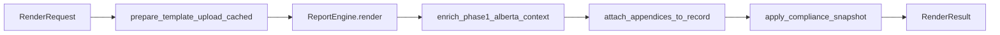
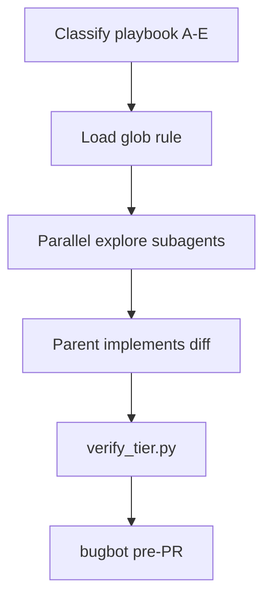

# 05 — Developer guide

Guide for maintaining and extending the ESA Report Generator codebase.

## Design principles

1. **`engine.py` is headless** — No Streamlit imports in the merge core (Power Automate / Azure ready).
2. **Warnings vs errors** — Missing scalar template vars warn and render empty; invalid files and missing required sheets error.
3. **Schema-first data** — `schemas/report_profiles.json` `recommended_fields` per profile drives pre-flight warnings; extend profiles when adding production fields. Update `field_contract.json` for AI tagger / legacy docs if needed.
4. **Defense in depth** — Validate at upload, parse, context build, and output validation.

## Module reference

### `render_service.py`

Unified render pipeline for Streamlit, CLI, project folder, and automation. Derives appendix labels **before** Word merge so DWDA/SED enrichment matches uploaded appendices.

| Symbol | Role |
|--------|------|
| `RenderRequest` | Excel/template bytes, meta, row index, uploaded appendices, optional `appendix_labels_present` |
| `RenderResult` | `docx_bytes`, `context`, `record`, `appendices`, `warnings`, optional `package_bytes` |
| `render_report` | Single report: engine render + attach appendices + `apply_compliance_snapshot` |
| `render_batch_reports` | One report per `ProjectData` row; same appendix set for all rows (batch limitation) |
| `render_deliverable_package` | `render_report` + deliverable zip bytes |



**Agent note:** When changing DWDA/SED enrichment, update `tests/test_render_path_parity.py` and run `scripts/dwda_workflow_e2e.py`.

### `engine.py`

| Symbol | Role |
|--------|------|
| `PROJECT_SHEET`, `LAB_SHEET` | `ProjectData`, `LabResults` |
| `DRILLING_WASTE_SHEET`, `STORAGE_TANKS_SHEET` | Optional Alberta Phase I table sheets |
| `ECOVENTURE_CONSULTANT` | Default firm string (`Ecoventure Inc.`) |
| `ReportEngine` | Main class: construct with bytes, call `build_context`, `render`, `dry_run`, `coverage` |
| `generate_phase1_alberta_excel/docx` | Committed Alberta Phase I sample fixtures |
| `collect_template_root_vars` | Parse `{{ root }}` from template ZIP XML |
| `suggested_download_name` | Safe output filename from context + meta |
| `generate_*_excel/docx` | Sample/production fixture builders |
| `PRODUCTION_BRACKET_REPLACEMENTS` | Map for `tag_production_template.py` |

**`ReportEngine` lifecycle:**

```python
engine = ReportEngine(excel_bytes=b"...", template_bytes=b"...")
context = engine.build_context(meta={"prepared_by": "..."})
docx, warnings, context, record = engine.render(meta=meta)
```

Render uses `SandboxedEnvironment` + `StrictUndefined` for Jinja inside docxtpl.

### `security.py`

Upload validators, `ZipReadBudget`, `clamp_context`, `sanitize_meta`, `user_safe_error`, `open_docx_zip`. Tunable constants at file top (`MAX_EXCEL_BYTES`, etc.).

Environment bypass for tests only: `ESA_VALIDATION_BYPASS=1`.

### `template_tools.py`

| Symbol | Role |
|--------|------|
| `TemplateCoverage` | matched / missing / unused vars |
| `PreflightResult` | errors, warnings, `can_generate` |
| `scan_template` | Vars, blocks, split-run lint |
| `run_preflight` | Full pre-render check |
| `missing_fields_checklist` | Markdown text for Excel planning |

### `report_profile.py`

`resolve_report_config`, `read_excel_meta`, `get_recommended_fields`, `build_report_config_workbook_bytes`, template loop discovery.

### `template_attachments.py`

`prepare_template_upload` — PDF → DOCX via pdf2docx; `PreparedTemplate` dataclass.

### `appendix_generator.py`

`render_phase1_appendices`, `attach_appendices_to_record`, `predicted_appendix_labels`, `merge_appendix_lists` — auto-render SED 002 appendices **A**, **D**, and **G** from the same Jinja context as the main report. Templates in `samples/appendices/`; profile mapping via `appendix_templates` in `schemas/report_profiles.json`. No Streamlit imports.

### `deliverable_pack.py`

`build_deliverable_zip`, `build_deliverable_zip_bytes`, `build_onestop_export_bytes`, `AppendixFile`, `appendix_manifest_entries`, `enrich_manifest_dict`, `build_batch_reports_zip` — zip includes:

- Report `.docx` + manifest JSON
- `appendices/` — uploaded PDFs + generated A/D/G `.docx`
- `qp_checklists/` — SED 002 and DWDA QP review markdown (Phase I Alberta profiles)
- `onestop/` — summary JSON/CSV for OneStop upload prep

### `compliance_helpers.py`

Shared helpers for SED/DWDA/Ecoventure: `normalize_appendix_labels`, `resolved_appendix_labels`, `yes_value`, `has_value`, `parse_float`.

### `phase2_triggers.py`

`collect_phase2_reasons`, `is_phase2_likely` — unified Phase II trigger collection from ProjectData, drilling waste rows, and DWDA calc/compliance objects.

### `dwda_compliance.py` / `dwda_calculations.py` / `ecoventure_workbook.py`

- **`dwda_compliance.py`** — Directive 050 checklist evaluation, `enrich_dwda_context`, QP checklist markdown
- **`dwda_calculations.py`** — metal/salt/DST calc engine; reads [`schemas/dwda_salt_additives.json`](../schemas/dwda_salt_additives.json)
- **`ecoventure_workbook.py`** — hybrid ingest from Ecoventure xltm/xlsx cell contract

See [21-dwda-directive-050-compliance.md](21-dwda-directive-050-compliance.md) and [23-excel-calculation-workbook-integration.md](23-excel-calculation-workbook-integration.md).

### `phase1_narrative.py`

`build_phase1_executive_summary` — Signum-style structure, Ecoventure voice.

### `phase1_decision.py`

`evaluate_phase2_triggers`, `enrich_context_phase2_decision`, **`enrich_phase1_alberta_context`** — Phase II ESA heuristics aligned with SED 002; DWDA + SED enrichment for Alberta Phase I; adds `phase2_recommended`, `phase2_reasons`, and stores `_sed002_compliance` on context for deliverable zip QP checklists. Phase II reasons delegate to **`phase2_triggers.collect_phase2_reasons`**.

### `sed002_compliance.py`

`evaluate_sed002_compliance`, `build_qp_review_checklist_markdown` — SED 002 §10 checklist driven by [`schemas/sed002_phase1_checklist.json`](../schemas/sed002_phase1_checklist.json); used in preflight and QP review export.

### `provenance.py`

`GenerationRecord` dataclass, `build_generation_record`, `sha256_hex`, **`apply_compliance_snapshot`**.

Compliance snapshot fields on manifest (via `apply_compliance_snapshot`): `sed002_completeness_pct`, `dwda_checklist_scope`, `appendix_labels_evaluated`, `phase2_reasons`, `dwda_calc_source`.

Also: `report_type`, `template_source_format`, `appendix_files`, `generated_appendix_files`.

### `field_validation.py`

`contract_warnings` — reads `report_profiles.json` first; falls back to `field_contract.json`.

### `project_folder.py`

Headless local folder workflow (no Streamlit):

| Symbol | Role |
|--------|------|
| `resolve_project_folder` | Validate layout; resolve Excel + template paths |
| `ResolvedProjectFolder.read_core_files` | Cached Excel/template bytes (mtime LRU) |
| `enrich_project_folder` | AI advisory modes: inventory, source-ingest, narratives, appendix-classify |
| `render_project_folder` | Render to `delivered/` + optional deliverable zip |
| `init_sample_project_folder` | Seed demo folder (Phase I or `profile="phase2_esa"`) |

CLI: `scripts/ingest_project_folder.py` · Streamlit: `ui/project_folder.py` · See [22-project-folder-workflow.md](22-project-folder-workflow.md).

### `app.py`

Streamlit orchestration only: session state, workflow picker, uploads or folder load, calls `ui/*`, **`render_service`** on generate (single + batch).

### `ui/` package

**Report tab order** (must match [esa-streamlit-ui.mdc](../.cursor/rules/esa-streamlit-ui.mdc)): next steps → pre-flight → **Generate** → appendices → deliverable zip → Advanced → Help & documentation.

| Module | Role |
|--------|------|
| `onboarding.py` | Welcome card, **Your next steps** (`compute_next_actions`), glossary, Simple mode |
| `sidebar.py` | Profile, phase sync, meta, Simple mode, sample load button, **getting-started checklist**, sample downloads |
| `phrase_panel.py` | Standard phrases selectboxes → `phrase_meta` merged into render meta |
| `helpers.py` | Template cache, PDF conversion, `_ensure_samples`, sample session load, upload/engine caches |
| `preflight.py` | Cached preflight, SED 002 / DWDA in labeled expanders, `can_generate`, ReportConfig export |
| `preview.py` | Dry-run panel (Advanced expander on Report tab) |
| `appendix_panel.py` | Appendix A–H checklist/uploads; `build_deliverable_zip_for_session()` (bytes; UI in `results.py`) |
| `results.py` | **`render_deliverable_success`**, **`render_batch_deliverable_success`** — primary zip, OneStop checklist, Advanced downloads; `render_batch_download_section` is a legacy alias |
| `layout.py` | Section headers, upload zones, generate CTA, workflow stepper, **context strip** (`render_workflow_context_strip`) |
| `workflow_mode.py` | Startup picker + public APIs: `WORKFLOW_*`, `get_workflow_mode`, `clear_generation_session`, `reset_workflow_session` (do not call private `_clear_*`) |
| `project_folder.py` | Folder path loader, Browse/Load/Analyze, meta merge, session bundle cache |
| `folder_picker.py` | Native OS folder dialog (tkinter; headless → manual path) |
| `branding.py` | Compact header + global CSS (stepper, badges, sticky CTA); `status_badge_html` |
| `menubar.py` | Windows-style File/Edit/View/Tools/Help; F1 → `help/index.html`; rebuild with `python scripts/build_help.py` after docs/help/menubar edits |
| `alberta_imagery.py` | Hero imagery cache for header |
| `ai_panel.py` | AI tab (Tier 1 & 2); sidebar under **Advanced — AI options** when Simple mode on |

**Streamlit widget rule:** never assign `st.session_state.<widget_key>` after that widget is instantiated. Use a pending key set before render (e.g. `project_folder_path_pending`).

### `ai/` package

Optional LLM features; each module has offline fallback. Does not modify `ReportEngine.render` logic.

| Module | Role |
|--------|------|
| `source_ingest.py` | Ingest `source/` PDFs → `ai_drafts/source_summaries.json`; optional `rag/` snippets |
| `narrative.py` | Section drafts; reads `_source_summaries` from folder enrich |
| `copilot.py` | Pre-flight copilot advice |
| `appendix_classifier.py` | Heuristic / LLM appendix label suggestions |
| `lab_extract.py` | Lab COA PDF → structured extract |
| `rag.py` | Project + global RAG corpus for prompts |

### `automate/` package

`render.py` — path/bytes wrappers; `http_server.py` — localhost POST `/render`.

## Session state keys (`app.py`)

| Key | Type | Purpose |
|-----|------|---------|
| `generated_docx` | `bytes \| None` | Last render output |
| `generated_filename` | `str \| None` | Download name |
| `warnings` | `list[str]` | Last render warnings |
| `last_context` | `dict \| None` | Preview dict |
| `generation_record` | `GenerationRecord \| None` | Manifest source |
| `rendering` | `bool` | Concurrency guard |
| `ai_audit_log` | `list` | Copied into manifest on generate |
| `ux_welcome_dismissed` | `bool` | Welcome card dismissed |
| `ux_simple_mode` | `bool` | Simple mode toggle (sidebar) |
| `ux_checklist_dismissed` | `bool` | Getting started checklist dismissed |
| `ux_deliverable_download_clicked` | `bool` | User clicked primary deliverable zip |
| `session_excel_bytes` | `bytes \| None` | Sample load or session Excel |
| `session_template_bytes` | `bytes \| None` | Sample load or session template |
| `session_excel_name` | `str \| None` | Filename for session Excel |
| `session_template_name` | `str \| None` | Filename for session template |

## Architecture backlog (deferred)

Items documented for team planning; not implemented in the current Streamlit UI.

| Item | Notes |
|------|--------|
| **Microsoft Entra ID** | Recommended: reverse proxy / Azure App Proxy in front of Docker host ([14-deployment.md](14-deployment.md), [16-team-rollout.md](16-team-rollout.md)). CLI/automation unchanged. |
| **Split `engine.py`** | Extract `engine_context.py` / `engine_batch.py` when adding major profiles — high regression cost; run full E2E after. |
| **Per-row batch appendices** | Today one appendix upload set applies to all batch rows; needs `RenderRequest` per-row map + UI. |
| **Word → PDF for appendices D/G** | OneStop checklist still manual export in Word; defer LibreOffice headless or M365 Graph unless committed. |
| **Playwright in CI** | Optional local only ([`scripts/playwright_smoke.py`](../scripts/playwright_smoke.py)); AppTest covers most UX. |

## Extending the engine

### Add a new ProjectData field

1. Add column to Excel / `production_data.xlsx`.
2. Add to `schemas/report_profiles.json` `recommended_fields` for the relevant profile (and `field_contract.json` if AI tagger needs it).
3. Add `{{ field }}` to Word template.
4. No code change required if header normalizes to existing Jinja name.

### Add computed fields

Extend `build_context` in `ReportEngine` after `project` dict is built:

```python
ctx["report_year_short"] = ctx.get("report_year", "")[:4]
```

### Add lab row computed fields

Extend `_lab_frame_to_records` in `engine.py`.

### Batch reports

- Multiple non-blank `ProjectData` rows (row 1 = headers).
- `ReportEngine.render_batch()` / Streamlit **All N sites (batch zip)** via `render_service.render_batch_reports` / `render_cli.py --all-rows`.
- **Batch limitation:** the same uploaded appendix set applies to every row; per-row appendix labels are not supported yet.
- Table sheets can link per site via `site_name`, `project_number`, `uwi`, `well_name`, or `project_id`.
- Limits: `MAX_PROJECT_ROWS` (100), `MAX_BATCH_REPORTS` (50).

## Coding conventions

- Python 3.10+ type hints (`from __future__ import annotations`).
- User-facing errors: `SecurityError` or `ValueError` with safe messages; `user_safe_error()` in UI.
- Logging: `logger.exception` on render failure in `app.py`.
- Tests: `unittest` in `tests/`; samples required for E2E (committed in repo).

## Dependencies

See `requirements.txt`. Core: `streamlit`, `docxtpl`, `pandas`, `openpyxl`, `python-docx`, `Jinja2`, `pdf2docx`, `pypdf`. Optional AI: `openai`.

## Local development loop

```powershell
pip install -r requirements.txt
python scripts\create_samples.py
python -m unittest discover -s tests -v
streamlit run app.py
```

## CI

GitHub Actions: `.github/workflows/ci.yml` — install, samples, appendix templates, tag, unittest, Streamlit AppTest smoke, CLI smoke, package smoke, production E2E, Phase I/II/III E2E, project-folder CLI, user docs test, DWDA E2E, 18-step health check. See [08-testing.md](08-testing.md) for the full step list.

## Cursor multi-agent orchestration

For day-to-day development with Cursor: parent agent classifies work, delegates discovery to subagents, and runs verification before merge. Index: [AGENTS.md](../AGENTS.md#multi-agent-workflow-cursor) · skill: [`.cursor/skills/esa-dev-orchestration/SKILL.md`](../.cursor/skills/esa-dev-orchestration/SKILL.md) · rule: [`.cursor/rules/esa-dev-orchestration.mdc`](../.cursor/rules/esa-dev-orchestration.mdc).



### Verification runner

```powershell
python scripts\verify_tier.py --tier unit
python scripts\verify_tier.py --tier ux
python scripts\verify_tier.py --tier profile --playbook b
python scripts\verify_tier.py --tier release
```

Optional **pre-commit** (UX tier when `app.py` or `ui/` is staged):

```powershell
pip install pre-commit
.\scripts\install_pre_commit.ps1
# skip once: git commit --no-verify
```

### Live orchestration example

Typical parent-agent session for a small UX fix:

1. **Classify** — playbook **A** (Streamlit). Load [esa-streamlit-ui.mdc](../.cursor/rules/esa-streamlit-ui.mdc).
2. **Parallel explore** (readonly subagents):
   - *Map `render_next_actions_card` callers and Report tab order in `app.py`.*
   - *List AppTest patterns in `tests/test_streamlit_smoke.py`.*
3. **Parent implements** — focused diff in `ui/` + test update.
4. **Shell subagent** — `python scripts\verify_tier.py --tier ux`.
5. **Pre-PR** — bugbot on `branch changes`; security-review only if uploads touched.

Copy-paste starter:

> Classify playbook A. Explore `ui/onboarding.py` and `tests/test_streamlit_smoke.py` in parallel. Implement the change. Shell: run `verify_tier.py --tier ux`. Then bugbot on branch changes.

### PR checklist

Copy into PR description or use [`.github/pull_request_template.md`](../.github/pull_request_template.md):

- [ ] **Playbook** identified (A UX / B engine / C compliance / D schemas / E CI)
- [ ] Relevant **`.cursor/rules/`** glob rule read
- [ ] **Hard boundaries** respected (`render_service`, no Streamlit in `engine.py`, profile fields in `report_profiles.json`)
- [ ] **Verification tier** run (see AGENTS.md table)
- [ ] `python scripts\count_tests.py` PASS (if tests added/removed)
- [ ] **bugbot** run on branch changes (or note why skipped)
- [ ] **security-review** run if `security.py`, uploads, or deploy touched

## Related

- [06-api-reference.md](06-api-reference.md) — Public functions and scripts
- [08-testing.md](08-testing.md) — Test matrix
