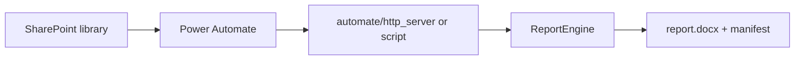

# Power Automate integration guide

Step-by-step recipe to generate reports from SharePoint files using the same engine as Streamlit.

## Architecture



## Option A — HTTP on a secured Windows VM

1. **Host** the app or HTTP service on a machine joined to your tenant (VPN or private endpoint).
2. **Start** the local render service:

   ```powershell
   python -m automate.http_server --port 8765
   ```

3. **Power Automate flow**
   - **Trigger:** When a file is created in a SharePoint folder (e.g. `Requests/`).
   - **Get file content** for the uploaded `.xlsx` and `.docx` (or `.pdf` template).
   - **HTTP POST** `http://127.0.0.1:8765/render` (or your internal hostname):
     - `excel` — file content (multipart)
     - `template` — file content (multipart)
     - `meta` — JSON string, e.g.:

       ```json
       {
         "prepared_by": "Ecoventure QP",
         "date_of_issue": "2026-05-20",
         "report_phase": "Phase 1",
         "report_type": "phase1_alberta",
         "template_version": "2.1"
       }
       ```

   - **Response:** rendered `.docx` body; read warnings from header `X-ESA-Warnings` if present.
   - **Create file** in SharePoint `Delivered/` with the response bytes.
   - **Optional:** POST manifest JSON to a second library or append to a log list.

4. **PDF templates:** upload `.pdf`; the server converts to Word before merge (same as Streamlit). Tag the converted file in Word for production templates.

## Option B — Run script action (desktop / Azure VM)

Use `automate.render.render_report_from_paths` from a PowerShell wrapper:

```powershell
python -c "from automate.render import render_report_from_paths; render_report_from_paths('in/data.xlsx','in/template.docx','out/report.docx', meta={'report_phase':'Phase 2','report_type':'phase2_esa'})"
```

Map SharePoint paths to local temp folders in the flow.

## Metadata fields

| Field | Purpose |
|-------|---------|
| `prepared_by` | Author on cover |
| `date_of_issue` | ISO date |
| `report_phase` | `Phase 1` or `Phase 2` |
| `report_type` | `phase1_alberta`, `phase2_esa`, `template_driven` |
| `template_version` | Audit in manifest |
| `executive_summary` | Optional override text |
| `template_source_format` | Set to `pdf` or `docx` when logging source type |

## Security

- Do not expose port 8765 to the public internet.
- Use a service account with least privilege on SharePoint libraries.
- Validate file extensions server-side (already enforced in `security.py`).

## Testing without Power Automate

```powershell
python scripts\render_cli.py --excel samples\phase1_alberta_data.xlsx --template samples\phase1_alberta_template.docx --out out\test.docx
python scripts\health_check.py
```

## Related

- [AUTOMATE.md](../AUTOMATE.md)
- [06-api-reference.md](06-api-reference.md)
- [14-deployment.md](14-deployment.md)
