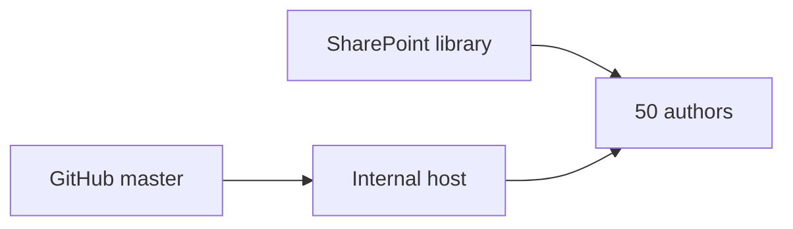

# 16 — Team rollout (~50 users)

How to share the ESA Report Generator with coworkers with **minimal maintenance**: one internal app, standards on SharePoint, GitHub as source of truth.

## Recommended model

| Layer | What | Who maintains |
|-------|------|----------------|
| **GitHub** | Code, tests, releases | Developer / owner |
| **Internal app** | Single Streamlit URL (Docker VM or Azure) | IT + owner |
| **SharePoint** | Guides, gold templates, client work | Template owner + authors |

Avoid 50 separate laptop installs as the primary model — each update would require `pip install` and support on every PC.



## Phase 1 — Standards on SharePoint (1–2 weeks)

**Goal:** Everyone uses the same Excel columns and Word tags before the shared app goes live.

1. Run `.\scripts\package_team_sharepoint.ps1` → upload `dist\team-sharepoint\` per [sharepoint/PUBLISH_CHECKLIST.md](../sharepoint/PUBLISH_CHECKLIST.md).
2. Post the Teams message from that checklist with links to **00-start-here** and template folders.
3. Assign **1–2 template owners**; read-only access for other authors.

**Files authors need first:**

- [00-start-here.md](00-start-here.md)
- [EXCEL_LAYOUT.txt](../EXCEL_LAYOUT.txt)
- [JINJA2_CHEATSHEET.txt](../JINJA2_CHEATSHEET.txt)
- `phase1_alberta_data` + `phase1_alberta_template` (versioned names on SharePoint)

## Phase 2 — Single internal app (main solution)

**Goal:** One URL for upload → pre-flight → generate → download.

Deploy using [14-deployment.md](14-deployment.md) (Docker, VM, or Azure Container Apps). Requirements:

- HTTPS on a private hostname (e.g. `https://esa-reports.company.internal`)
- **Microsoft Entra ID** (or VPN + network restriction) — do not expose Streamlit on the public internet without auth
- **Production controls enabled on Docker host:** `ESA_JSON_LOG=1`, `ESA_AUDIT_ENABLED=1`, audit volume mounted (see [14-deployment.md](14-deployment.md#production-hardening-internal-team-host))
- Secrets (`OPENAI_API_KEY` if using AI tab) in host secrets, not in GitHub

**Author workflow:** Same as [02-user-guide.md](02-user-guide.md) — choose **Excel + Word template** or **Project folder + AI** (local desktop Browse; see [22-project-folder-workflow.md](22-project-folder-workflow.md)), sidebar profile, optional phrases and appendices, deliverable zip.

**Updates:** Follow [17-server-update-runbook.md](17-server-update-runbook.md) (typically &lt; 15 minutes per release).

## Phase 3 — Pilot then full rollout

### Pilot (3–5 authors, 1–2 weeks)

| Step | Action |
|------|--------|
| 1 | Deploy internal app to pilot URL (can be same host, restricted group in Entra) |
| 2 | Select pilot users: one Phase I, one Phase II, one template author, one QA |
| 3 | Each pilot runs: **Load Alberta Phase I sample** → Generate → **Download deliverable package (.zip)**; save manifest JSON |
| 4 | Collect feedback: next-steps card clarity, OneStop checklist, PDF templates, batch mode |
| 5 | Run `python scripts\health_check.py` on server after any template change |

**Pilot exit criteria:**

- [ ] All pilots completed generate + **deliverable zip** download without IT help
- [ ] Pilots understood **Your next steps** and primary download button without developer help
- [ ] First deliverable zip from **Load sample** in under 5 minutes unaided (per pilot)
- [ ] At most 2 “which download button?” support questions per pilot user
- [ ] Template owner signed off Alberta Phase I sample pair
- [ ] No blocking security findings from [07-security-and-deployment.md](07-security-and-deployment.md)
- [ ] Update runbook tested once on server

### Full team (~50 users)

| Step | Action |
|------|--------|
| 1 | Open Entra access to all report authors (or company security group) |
| 2 | Teams announcement: app URL + SharePoint library + link to 00-start-here |
| 3 | Optional: 30-minute live demo (**Load sample** → pre-flight → generate → **deliverable zip**) |
| 4 | Name **internal support contact** (template + app); escalate IT for host down |

**Defer Power Automate** ([15-power-automate-guide.md](15-power-automate-guide.md)) until the Streamlit app is stable for 4+ weeks — automation is harder to support without interactive pre-flight.

## If IT capacity is limited (interim)

Until Phase 2 is live:

- **Champions model:** 3–5 people run locally from GitHub ([README](../README.md)); others send Excel for generation.
- **Shared PC:** One office workstation with `streamlit run app.py` and Remote Desktop (single install, not ideal at scale).

Still plan central hosting — maintenance cost grows with every local install.

## Local install (pilot / developers only)

```powershell
git clone https://github.com/mutax2003/Report-Generator.git
cd Report-Generator
python -m venv .venv
.\.venv\Scripts\Activate.ps1
pip install -r requirements.txt
streamlit run app.py
```

Use localhost only unless you understand [07-security-and-deployment.md](07-security-and-deployment.md).

## Related

| Doc | Topic |
|-----|--------|
| [14-deployment.md](14-deployment.md) | Docker, Azure, Entra proxy |
| [17-server-update-runbook.md](17-server-update-runbook.md) | Release updates on server |
| [sharepoint/PUBLISH_CHECKLIST.md](../sharepoint/PUBLISH_CHECKLIST.md) | SharePoint upload steps |
