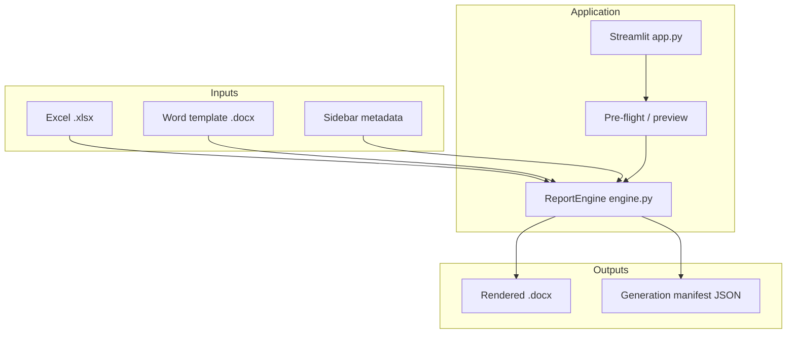

# ESA Report Generator — Documentation

Complete documentation for the Environmental Site Assessment (ESA) report generation system. This tool merges Excel project data and laboratory results into Word templates using Jinja2 ([docxtpl](https://docxtpl.readthedocs.io/)), delivered through a Streamlit web interface and headless automation APIs.

**Coding agents:** see [../AGENTS.md](../AGENTS.md) for rules, setup, and quick commands.

## Audience

| Document | Who it is for |
|----------|----------------|
| [00-start-here.md](00-start-here.md) | **Consultants** — upload, profile, generate, appendices (one page) |
| [01-overview.md](01-overview.md) | Everyone — purpose, architecture, data flow |
| [02-user-guide.md](02-user-guide.md) | Consultants, report authors, QA reviewers |
| [03-excel-data-guide.md](03-excel-data-guide.md) | Data preparers — workbook structure and field contract |
| [04-template-authoring.md](04-template-authoring.md) | Word template authors — Jinja2, tables, production merge |
| [05-developer-guide.md](05-developer-guide.md) | Developers — modules, extension points, conventions |
| [06-api-reference.md](06-api-reference.md) | Integrators — `ReportEngine`, CLI, HTTP, automation |
| [07-security-and-deployment.md](07-security-and-deployment.md) | IT / admins — limits, deployment, hardening |
| [08-testing.md](08-testing.md) | QA / developers — unit tests, E2E, CI |
| [09-ai-assistant.md](09-ai-assistant.md) | Power users — optional AI tab features |
| [10-glossary-faq.md](10-glossary-faq.md) | Quick lookup — terms and common questions |
| [11-alberta-phase1-esa.md](11-alberta-phase1-esa.md) | Alberta O&G Phase I — **Ecoventure Inc.** |
| [12-testing-with-your-documents.md](12-testing-with-your-documents.md) | **Test with your Excel + Word templates** |
| [13-flexible-report-profiles.md](13-flexible-report-profiles.md) | **Report types / custom templates + Excel mapping** |
| [14-deployment.md](14-deployment.md) | IT — Docker, Azure, Entra ID, production checklist |
| [15-power-automate-guide.md](15-power-automate-guide.md) | M365 — SharePoint trigger → HTTP render flow |
| [16-team-rollout.md](16-team-rollout.md) | **Team lead / IT** — ~50 users, SharePoint, pilot, central app |
| [17-server-update-runbook.md](17-server-update-runbook.md) | **Ops** — git pull, health check, restart, Teams announce |
| [18-groundwater-reports.md](18-groundwater-reports.md) | **Groundwater monitoring** — wells, levels, GroundwaterLab |
| [19-charts-and-gis-embed.md](19-charts-and-gis-embed.md) | Power BI / QGIS figures in Word reports |
| [20-aer-sed002-phase1-esa.md](20-aer-sed002-phase1-esa.md) | **AER SED 002** — Phase 1 §10 checklist, OneStop export |
| [21-dwda-directive-050-compliance.md](21-dwda-directive-050-compliance.md) | **DWDA / Directive 050** — calculate scope, generate appendices A/D/G |
| [22-project-folder-workflow.md](22-project-folder-workflow.md) | **Project folder** — local CLI + AI enrich + render |
| [23-excel-calculation-workbook-integration.md](23-excel-calculation-workbook-integration.md) | **Excel calc workbooks** — hybrid ingest, cell contract, parity testing |
| [24-remediation-reports.md](24-remediation-reports.md) | **Phase II, remediation, reclamation** sample pairs and checklists |

## Quick start

```powershell
cd "c:\Users\Andrew Liu\Report Generator"
python -m venv .venv
.\.venv\Scripts\Activate.ps1
pip install -r requirements.txt
streamlit run app.py
```

Demo files: `samples/sample_data.xlsx` + `samples/sample_template.docx`.

## Legacy quick-reference files (root)

These remain as one-page references; full detail is in the docs above.

| File | Topic |
|------|--------|
| [../EXCEL_LAYOUT.txt](../EXCEL_LAYOUT.txt) | Excel sheet names and columns |
| [../JINJA2_CHEATSHEET.txt](../JINJA2_CHEATSHEET.txt) | Word `{{ tags }}` and table loops |
| [../PRODUCTION_TEMPLATE_GUIDE.txt](../PRODUCTION_TEMPLATE_GUIDE.txt) | Production merge document tagging |
| [../BEST_PRACTICES.md](../BEST_PRACTICES.md) | Mail-merge / audit patterns |
| [../AI_FEATURES.md](../AI_FEATURES.md) | AI tab summary (see also [09-ai-assistant.md](09-ai-assistant.md)) |
| [../AUTOMATE.md](../AUTOMATE.md) | Automation summary (see also [06-api-reference.md](06-api-reference.md)) |

## Document map


